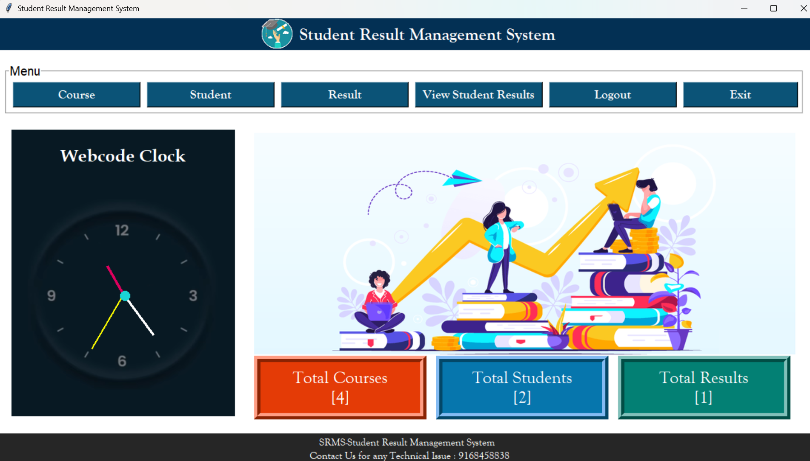

# 🎓 Student Result Management System

A desktop-based application developed using **Python (Tkinter)** and **SQLite**, designed to manage and streamline student records and academic results with an interactive graphical user interface (GUI). This project simplifies the process of maintaining student data and calculating results efficiently.

---

## 📌 Project Overview

The **Student Result Management System** is a simple yet effective application created to automate the record-keeping and result computation for educational institutions. It provides a user-friendly interface for adding, updating, deleting, searching, and displaying student information and result data.

---

## ✅ Features

- ➕ Add New Student Records  
- 🔄 Update Student Details  
- ❌ Delete Student Records  
- 🔍 Search Student by Roll Number  
- 📋 Display All Students in a Table Format  
- 📝 Enter Subject-Wise Marks  
- 📊 View Results (Total Marks and Percentage)  
- 📜 Scrollable Data Table using Treeview  
- ✔️ Data Validation and Error Handling  
- 💾 Integrated SQLite Database  
- 🖥️ Interactive GUI with Tkinter  

---

## 🏗️ Project Structure

The **Student Result Management System** consists of the following main components:

### **1. User Interface (Frontend)**
- Developed using **Tkinter** (Python GUI framework).
- Includes forms for **student registration, result entry, and result display**.
- Provides an intuitive **menu-based navigation system**.

### **2. Database (Backend)**
- Uses **SQLite** for storing student records and results.
- Tables include:
  - **students** → Stores student details (Name, Roll Number, Class, etc.).
  - **results** → Stores marks for different subjects.
  
### **3. Functional Modules**

| Module          | Description |
|----------------|------------|
| `main.py` | Entry point of the application. Handles UI rendering and module navigation. |
| `student.py` | Manages student data (add, edit, delete, search). |
| `result.py` | Manages marks entry and calculates results. |
| `database.py` | Handles SQLite database operations (create, insert, update, delete). |
| `rms.db` | SQLite database storing student and result information. |
| `Course.py` | Manages course-related operations. |
| `Dashboard.py` | Provides an overview and analytics for student results. |
| `create_db.py` | Script for initializing the database. |
| `login.py` | Handles user authentication. |
| `register.py` | Manages user registration. |
| `report.py` | Generates student performance reports. |
| `README.md` | Project documentation. |

```
Student_Result_Management/
├── Images/                 # Folder for images used in GUI
├── Result_management_system/
│   ├── __pycache__/        # Compiled Python files
│   ├── Course.py           # Manages courses
│   ├── Dashboard.py        # Application dashboard
│   ├── README.md           # Project documentation
│   ├── create_db.py        # Script to create the database
│   ├── login.py            # Handles user login
│   ├── register.py         # Handles user registration
│   ├── report.py           # Generates reports
│   ├── result.py           # Handles student results
│   ├── rms.db              # SQLite database file
│   ├── student.py          # Manages student records
└── clock_new.png           # Clock image used in GUI
```

---

## 📥 Installation & Setup

Follow the steps below to run this project on your local machine:

### 1. Clone the Repository
```bash
git clone https://github.com/mansi306/student-result-management.git
cd student-result-management
```

### 2. Install Python
Ensure Python 3.x is installed on your system.
👉 [Download Python](https://www.python.org/downloads/)

### 3. Run the Application
```bash
python main.py
```

---

## 📸 Screenshots
### 🏠 Dashboard Page



---

## 📈 Future Enhancements

- 🔐 User Login and Authentication
- 📤 Export Results to PDF or Excel
- 📅 Attendance Management Integration
- 📈 Student Performance Analytics (Graphs & Charts)
- 👥 Role-based Access (Admin, Teacher)

---

## 🧠 Learning Outcomes

- GUI development using Tkinter
- Working with SQLite database operations
- Modular programming with Python
- Error handling and data validation
- Real-world software project development experience

---

## 📦 Requirements

This project uses only standard Python libraries. No external installations are required.

- Python 3.x
- Tkinter (pre-installed with Python)
- SQLite (integrated)

---

## 👤 Author

**Name:** Mansi Laxman Patil  
**Email:** mp8551142@gmail.com  
**GitHub:** [mansi306](https://github.com/mansi306)

---

## 📄 License

This project is licensed under the **MIT License** - feel free to use and modify it.

---

## ⭐ Support

If you like this project, don't forget to ⭐ star the repository.
Your feedback and suggestions are welcome!

